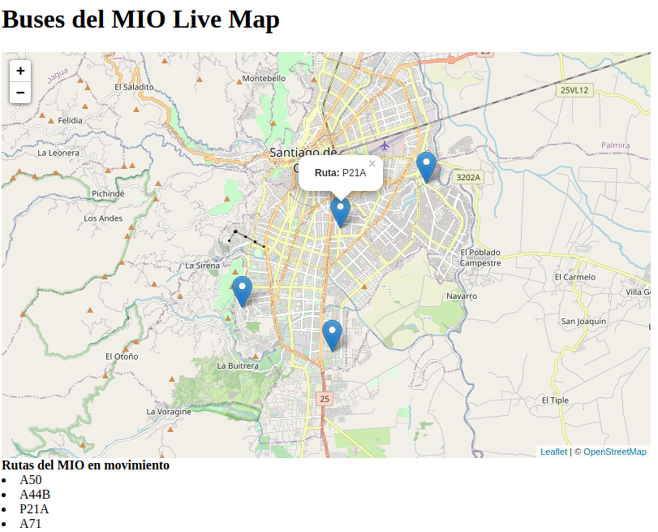

# MioLiveMap

**Realtime web-mapping using Apache kafka**

## Install Apache Kafka and dependecies

### Install Java

```bash
$ sudo apt update
$ sudo apt install default-jdk
```

### Download and Install Apache Kafka

```bash
$ wget https://downloads.apache.org/kafka/2.8.0/kafka_2.13-2.8.0.tgz

alternative:

$ wget http://52.12.133.74/kafka/kafka_2.13-2.8.0.tgz

$ tar xzf kafka_2.13-2.8.0.tgz
$ sudo mv kafka_2.13-2.8.0 /usr/local/kafka
```

### Download and install Zookeeper

```bash
$ sudo apt-get install zookeeperd
```

Create systemd unit file for Zookeeper 

```bash
$ vim /etc/systemd/system/zookeeper.service
```

Add the following:

```
[Unit]
Description=Apache Zookeeper server
Documentation=http://zookeeper.apache.org
Requires=network.target remote-fs.target
After=network.target remote-fs.target

[Service]
Type=simple
ExecStart=/usr/local/kafka/bin/zookeeper-server-start.sh /usr/local/kafka/config/zookeeper.properties
ExecStop=/usr/local/kafka/bin/zookeeper-server-stop.sh
Restart=on-abnormal

[Install]
WantedBy=multi-user.target
```

Create a Kafka systemd unit 

```bash
$ vim /etc/systemd/system/kafka.service
```

Add the following:

```
[Unit]
Description=Apache Kafka Server
Documentation=http://kafka.apache.org/documentation.html
Requires=zookeeper.service

[Service]
Type=simple
Environment="JAVA_HOME=/usr/lib/jvm/java-1.8.0-openjdk-amd64"
ExecStart=/usr/local/kafka/bin/kafka-server-start.sh /usr/local/kafka/config/server.properties
ExecStop=/usr/local/kafka/bin/kafka-server-stop.sh

[Install]
WantedBy=multi-user.target
```

Reload the systemd daemon

```bash
$ systemctl daemon-reload
```

### Start Kafka Server

```bash
$ sudo systemctl start zookeeper
$ sudo systemctl start kafka
$ sudo systemctl status kafka
```

### Create a Topic in Server

```bash
$ cd /usr/local/kafka
```

```bash
$ bin/kafka-topics.sh --create --zookeeper localhost:2181 --replication-factor 1 --partitions 1 --topic geodatamio
```

Show the topics created in Kafka

```bash
$ bin/kafka-topics.sh --list --zookeeper localhost:2181
```

Allow delete topics

```bash
$ cd /usr/local/kafka/config
$ vim server.properties
```

Add this line to the end 

```bash
delete.topic.enable=true
```


Delete a topic in Kafka

```bash
$ bin/kafka-topics.sh --zookeeper localhost:2181 --delete --topic geodatamio
```

### Run producers data

Install pykafka library

```bash
$ sudo pip install pykafka

```

```bash
$ cd Producers
$ python mio_bus.py ./routes/ruta_9.geojson A44B
$ python mio_bus.py ./routes/ruta_42.geojson P21A
$ python mio_bus.py ./routes/ruta_61.geojson A47
$ python mio_bus.py ./routes/ruta_25.geojson A71
```

### Run MapClient

Install Flask library

```bash
$ sudo pip install flask
$ sudo pip install wsgiserver
```

```bash
$ cd MapClient
$ python app.py
```

Visit `http://localhost:5001/` in your browser. The app should be up & running.



### Credits & Links

* Install apache kafka in Ubuntu [Apache Kafka](https://tecadmin.net/install-apache-kafka-ubuntu/)
* Realtime maps with Kafka, Python and Leaflet.js  [liveMaps](https://github.com/code-and-dogs/liveMaps)